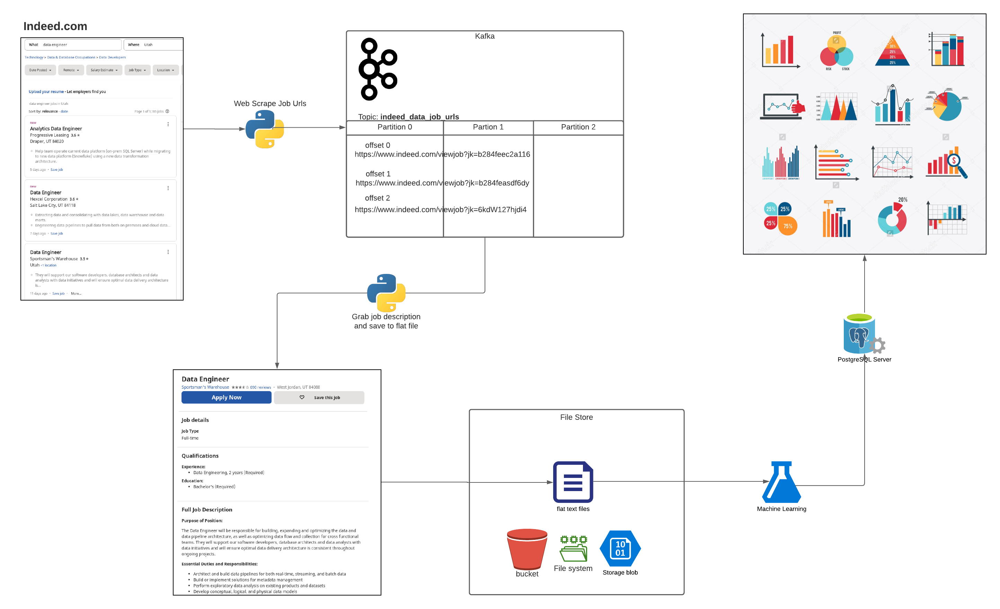

# Data Engineering Example ETL Pipeline

The goal of this repo is to show a somewhat contrived example of a data engineering ETL pipeline.
Although it is contrived it will also exaggerate in places maybe taking unnecessary steps for the sake
of demonstrating some import aspect of data engineering or technology that wouldn't be covered otherwise.

### The Goal:

We will be scraping and streaming data engineer job postings so we can perform analysis on what companies
look for when hiring data engineers.

## The Steps
 

### Step 1: Data at the source
Here we are working with job postings. We are using Indeed.com for no particular reason. We are scraping using Selenium,
Firefox, and BeautifulSoup.

### Step 2: Kafka the immutable queue
We are starting by sending the url we scraped in the previous step and publishing these to a Kafka topic. 
This allows us to decouple processing each url from grabbing the urls. This also gives us flexibility to create 
multiple processes off the first step of grabbing the url.

### Step 3: Using flat files
We are then creating flat files. These would usually be in an object storage layer like S3 or Cloud Storage but local
files work fine as well. We are saving these as text files. One improvement to this example/demo would be to use
Spark or Dask to read from the kafka stream and create parquet files. Parquet files are used quite often in
data engineering when storing flat files.

### Step 4: You can't run from sql
There is quite often a warehouse that most analysts and data scientists use most often when querying company
or external data. Some options include Redshift, Snowflake, Presto, Big Query or Sql Server. The main draw to this
type of system is performance. Time is valuable to an analyst or data scientist so you don't want to be waiting 
forever for your queries to come back.

### Step 5: Where most data ends up eventually (in a visualization)
We are using an open source offering for our Business Intelligence layer, Redash. Many companies use tools like
Tableau, Domo, Looker, etc. for this purpose. I'm a data engineer and although I have aspirations to create 
beautiful visualizations don't get your hopes up on how good these will look.

## What is next?
Well I can say a few things that are missing from this demo:
 - Good logging and alerting. We could use something like DataDog or Cloudwatch or the ELK stack or Prometheus. 
 - Tests, there are quite a few people I don't want to see this repo because it currently lacks any tests.
 - Orchestration! Every step in this could be orchestrated in a DAG using something like Airflow, Prefect, Luigi, etc.
 
 I'm not sure how much I want to hone this example.
 PRs Welcome!